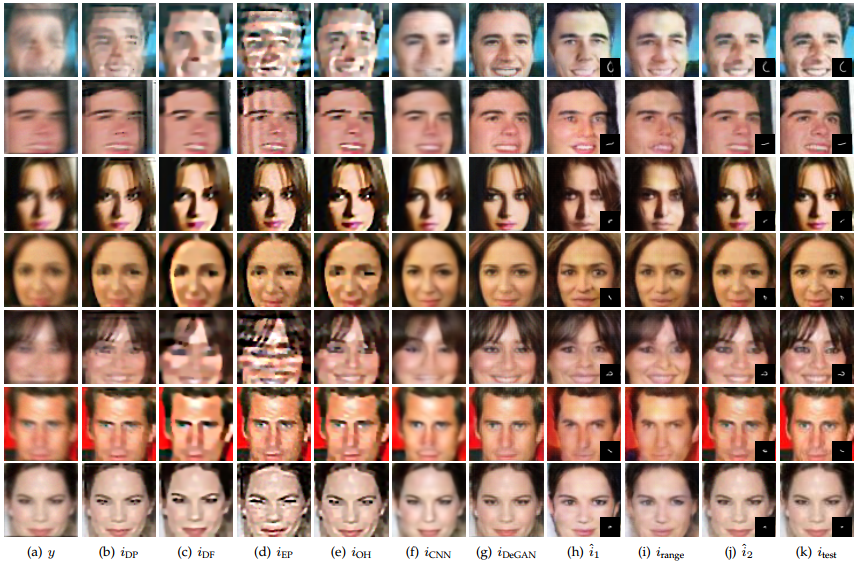
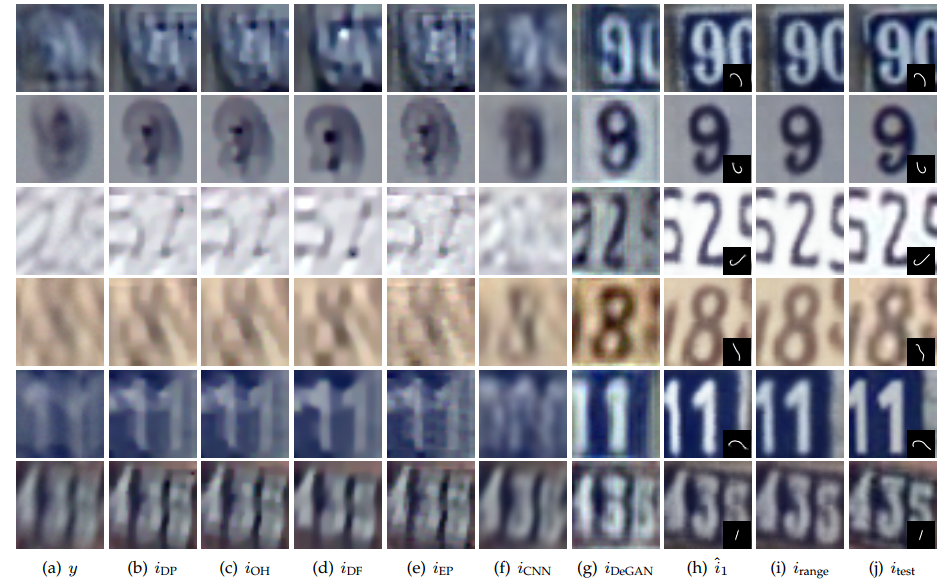
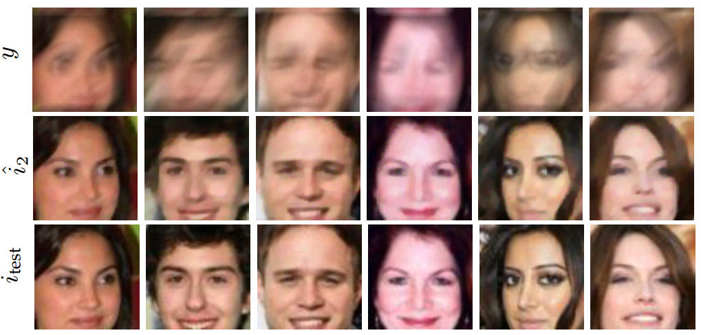
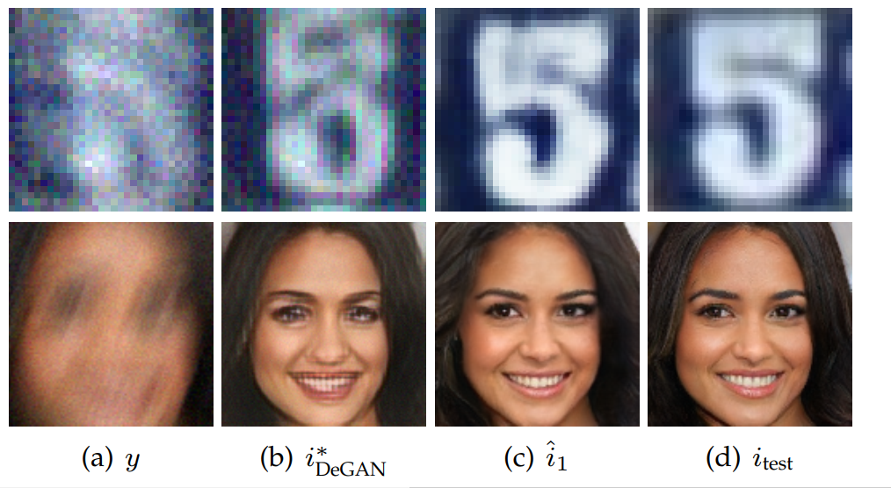

# Blind-Image-Deconvolution-using-Deep-Generative-Priors
Code for reproducing the result of paper [Blind Image Deconvolution using Deep Generative Priors](https://arxiv.org/abs/1802.04073). 

  

**Abstract**
This paper proposes a novel approach to regularize the *ill-posed* and *non-linear* blind image deconvolution (blind deblurring) using deep generative networks as priors. We employ two separate generative models --- one trained to produce sharp images while the other trained to generate blur kernels from lower-dimensional parameters.  To deblur, we propose an alternating gradient descent scheme operating in the latent lower-dimensional space of each of the pretrained generative models. Our experiments show promising deblurring results on  images even under large blurs, and heavy noise. To address the shortcomings of generative models such as mode collapse, we augment our generative priors with classical image priors and report improved performance on complex image datasets. The deblurring performance depends on how well the range of the generator spans the image class. Interestingly, our experiments show that even an untrained structured (convolutional) generative networks acts as an image prior in the image deblurring context allowing us to extend our results to more diverse natural image datasets. 

  

**How to Run**

1. Run `deblurring_*_algorithm_1.py`  for running algorithm 1 (proposed in paper)  for each dataset.
2. Run `deblurring_*_algorithm_2.py`  for running algorithm 2 (proposed in paper)  for each dataset.
3. Each `deblurring_*.py` file contains algorithm constants and parameters at the beginning under "constants" for experimentation purposes.
4. To produce closest range images (in paper) run `generate_range_images.py` with appropriate parameters, also included in the file.

Test images used for producing results in the paper are also made available in `results` folder along with our recovered images. Implementation of both algorithm 1 and 2 (proposed in paper) have been made available, along with pre-trained generative models for both image datasets and blurs. Code for algorithm 3 will be uploaded soon.

**Note:**
For re-producing results using [Progressive GAN (PG-GAN)](https://arxiv.org/abs/1710.10196) as generative model  (in paper), pre-trained model ,images from paper and deblurring code is also made available in folder `pg_gan`.  

  

**Experimental Results**

Image deblurred using Algorithm 1, 2 and 3 are denoted as  ,  and .

  

Deblurring results for Algorithm 1 using PG-GAN against baseline methods

  

  

Deblurring using Algorithm 1 and Algorithm 2 on celeba against baseline methods

  

  

Deblurring using Algorithm 1 and Algorithm 2 on svhn against baseline methods

  

  

Generative priors yield excellent results from unrecognizable blurry faces and are robust under noise.

  
  

